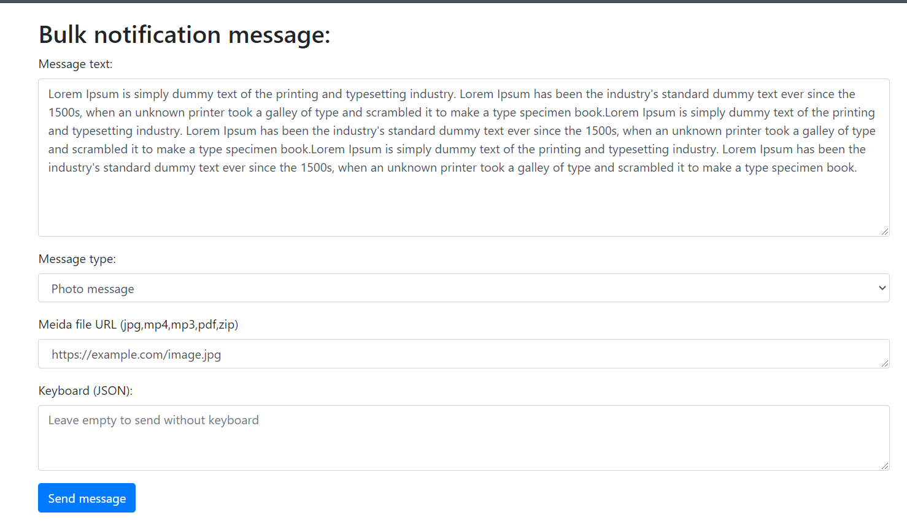
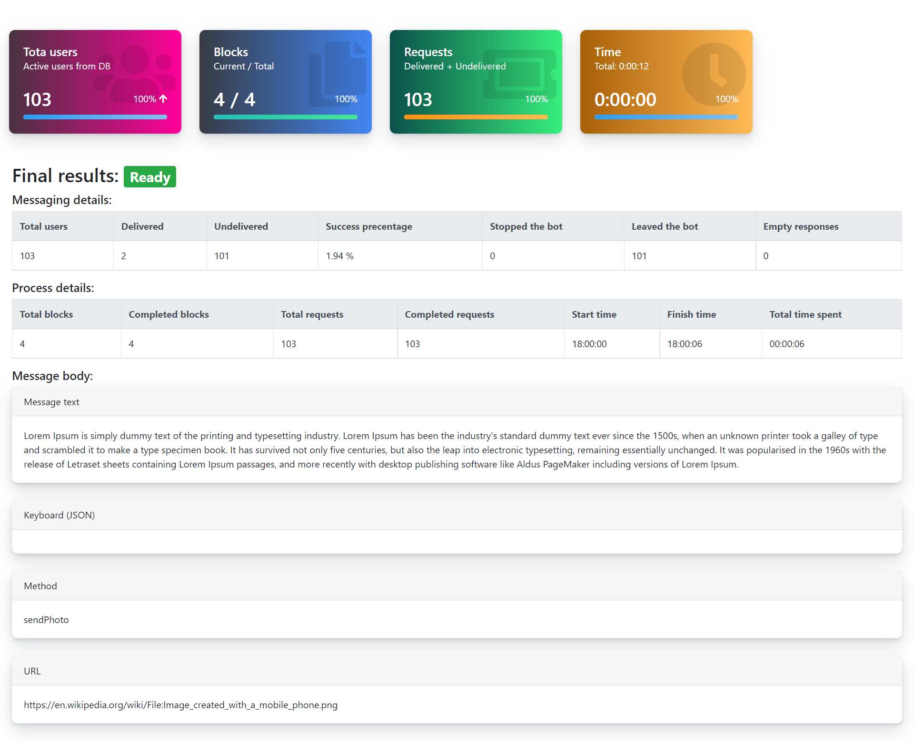

# Telegram-Bulk-Messaging
Now it is easy to send bulk notifications to your telegram users without hitting limitation.

**Features:**
 - Allows the processing of multiple cURL handles asynchronously (`curl_multi_init`).
 - Far from telegram bot API bulk messaging limitations
 - Real time monitoring the process
 - Detailed summary of process
 
**Installing:**
 1. Clone files to your local/shared hosing
 2. Change configurations in `/php/post.php` (6-12 lines)
 3. Now you can start using with index.html

### Author
 - Abdirasulov Javohir 
 - Telegram: https://t.me/JavohirSD
 - Gmail:    alienware7x@gmail.com 

**INDEX.HTML**

**PROCESS / RESULTS**

License
----

**Free and open source project template for everyone, Good luck!**
